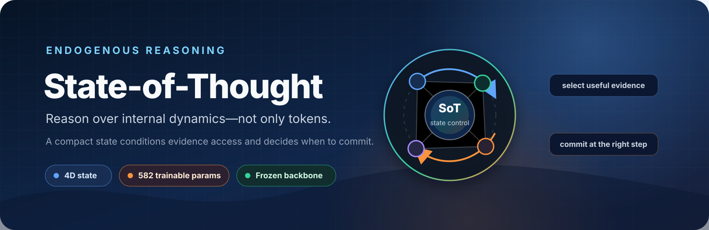
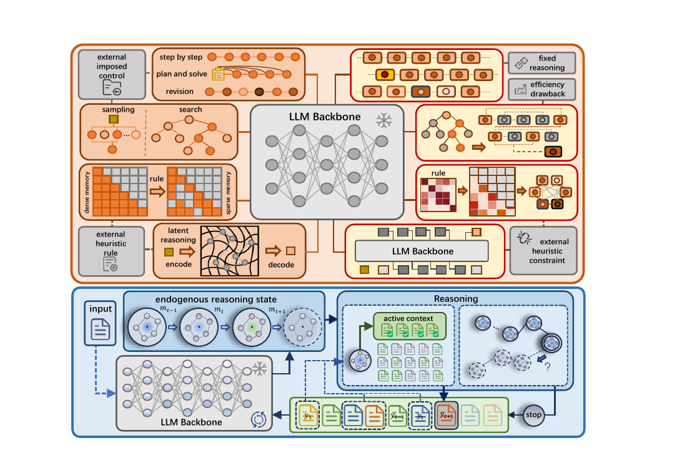

<p align="center">
  
</p>

<h1 align="center">State-of-Thought</h1>

<p align="center">
  <strong>Endogenous reasoning over frozen language and vision-language backbones</strong><br>
  A compact dynamics-geometric state controls evidence access and decides when reasoning is ready to commit.
</p>

<p align="center">
  <a href="https://arxiv.org/abs/2609.16055"></a>
  <a href="https://github.com/GongZhiren/State-of-Thought/releases/tag/v1.0.0"></a>
  <a href="https://github.com/GongZhiren/State-of-Thought/actions/workflows/release-check.yml"></a>
  <a href="https://www.python.org"></a>
  <a href="LICENSE"></a>
</p>

<p align="center">
  <a href="https://arxiv.org/abs/2609.16055"><strong>Paper</strong></a> ·
  <a href="https://gongzhiren.github.io/SoT-website/"><strong>Project page</strong></a> ·
  <a href="https://gongzhiren.github.io/SoT-website/tutorial.html"><strong>Tutorial</strong></a> ·
  <a href="#quick-start"><strong>Quick start</strong></a> ·
  <a href="REPRODUCIBILITY.md"><strong>Reproduce</strong></a> ·
  <a href="https://github.com/GongZhiren/State-of-Thought/releases/tag/v1.0.0"><strong>Release</strong></a>
</p>

<p align="center">
  <sub>Zhiren Gong · Yikun Hou · Zihao Zeng · Ming Xiao · Chau Yuen · Wei Yang Bryan Lim</sub>
</p>

| **4D** reasoning state | **582** trainable parameters | **Frozen** backbones | **3 LLM + 2 VLM** configurations | **19** reasoning datasets |
|:---:|:---:|:---:|:---:|:---:|
| dynamics + geometry | evidence gate + stop head | no backbone updates | text and multimodal | publication-aligned protocols |

## Why State-of-Thought?

Most reasoning pipelines control a model from the outside—through repeated
sampling, search, fixed heuristics, or an additional planner. SoT instead reads
the model's evolving internal information transfer and turns it into an
explicit, inspectable reasoning state.

> **Core idea.** Reasoning control should follow the trajectory already forming
> inside the backbone: retrieve prior evidence when it becomes useful, and stop
> when the internal state indicates that the answer is ready.

<p align="center">
  
</p>
<p align="center"><sub>SoT replaces externally imposed control with lightweight state-conditioned evidence selection and commitment.</sub></p>

At every reasoning step, SoT extracts four dynamics-geometric coordinates:

| Coordinate | What it captures | Control signal |
|---|---|---|
| **Dispersion** | how distributed the current representation is | breadth of the active reasoning state |
| **Velocity** | displacement across adjacent steps | how quickly reasoning is evolving |
| **Directional consistency** | alignment of successive displacements | whether the trajectory is stabilizing |
| **Instability** | local uncertainty in state evolution | whether more reasoning is still useful |

The resulting state drives a **16→32→1 evidence gate** (577 parameters) and a
**four-weight stopping head with one bias** (5 parameters). The backbone stays
frozen throughout.

## Quick start

### 1. Install

```bash
git clone https://github.com/GongZhiren/State-of-Thought.git
cd State-of-Thought
python -m venv .venv
source .venv/bin/activate
python -m pip install --upgrade pip
python -m pip install -e .
```

Add `.[vlm]` for vision-language inputs or `.[judge]` for the trajectory-quality
experiment. Backbone weights are downloaded separately from Hugging Face;
gated models require accepting their licenses and running `hf auth login`.

### 2. Verify a released checkpoint

This command is GPU-free and does not load a backbone:

```bash
sot checkpoint verify checkpoints/llama-3.1-8b/controller.pt
```

### 3. Evaluate or refit

Prepare the evaluation data described in [`data/README.md`](data/README.md),
then validate the frozen split before evaluation:

```bash
sot data validate --config experiments/paper/llama-3.1-8b.yaml
sot evaluate --config experiments/paper/llama-3.1-8b.yaml
```

Refit the controller end to end from the released offline trajectories:

```bash
sot train --config experiments/paper/llama-3.1-8b.yaml
```

Runs are record-first and resumable. Every summary retains the configuration,
checkpoint identity, record hashes, token counts, and wall-clock measurements.

## What's in the release

| Component | Included | Start here |
|---|---|---|
| **Runtime** | text and vision-language state extraction, evidence selection, stopping, and evaluation | [`src/sot/`](src/sot/) |
| **Training** | end-to-end fitting from numeric offline reasoning trajectories | [`sot.training`](src/sot/training.py) |
| **Checkpoints** | five frozen main controllers plus training-free, embedding, and judge artifacts | [`checkpoints/`](checkpoints/) |
| **Experiments** | paper-aligned configurations for three LLM and two VLM backbones | [`experiments/paper/`](experiments/paper/) |
| **Results** | curated summaries, immutable manifests, and publication-aligned per-example records | [`results/`](results/) |
| **Data contract** | ordered sample/reference hashes and reproducible VLM preparation | [`data/`](data/) |
| **Verification** | checkpoint, result, privacy, lint, package, and unit-test gates | [`Makefile`](Makefile) |

Training logs, temporary sweeps, failed or superseded runs, and unstructured
process files are intentionally excluded. Baseline implementations,
visualization-only analyses, interpretability probes, and defensive diagnostics
are outside the runtime release. Dataset and backbone weights remain governed
by their original licenses and are not redistributed.

## Reproducibility

The complete reproduction contract documents:

- exact model × dataset matrices and paper configurations;
- frozen checkpoint identities and SHA-256 hashes;
- ordered evaluation subsets and grading behavior;
- token accounting and latency protocols;
- training-free, embedding-based, and SoT-Judge extensions.

See **[REPRODUCIBILITY.md](REPRODUCIBILITY.md)** for the full workflow, or run
the repository-wide release gate directly:

```bash
make check test
```

## Paper

**[State of Thought Enables Endogenous Reasoning](https://arxiv.org/abs/2609.16055)**<br>
Zhiren Gong, Yikun Hou, Zihao Zeng, Ming Xiao, Chau Yuen, and Wei Yang Bryan Lim.

<details>
<summary><strong>BibTeX</strong></summary>

```bibtex
@misc{gong2026state,
  title         = {State of Thought Enables Endogenous Reasoning},
  author        = {Zhiren Gong and Yikun Hou and Zihao Zeng and Ming Xiao and Chau Yuen and Wei Yang Bryan Lim},
  year          = {2026},
  eprint        = {2609.16055},
  archivePrefix = {arXiv},
  primaryClass  = {cs.CL},
  url           = {https://arxiv.org/abs/2609.16055}
}
```

</details>

## License

The source code is released under the [MIT License](LICENSE). Model checkpoints,
datasets, and third-party software retain their respective licenses.

<p align="center"><sub>Built for transparent, end-to-end reproduction of State-of-Thought.</sub></p>
